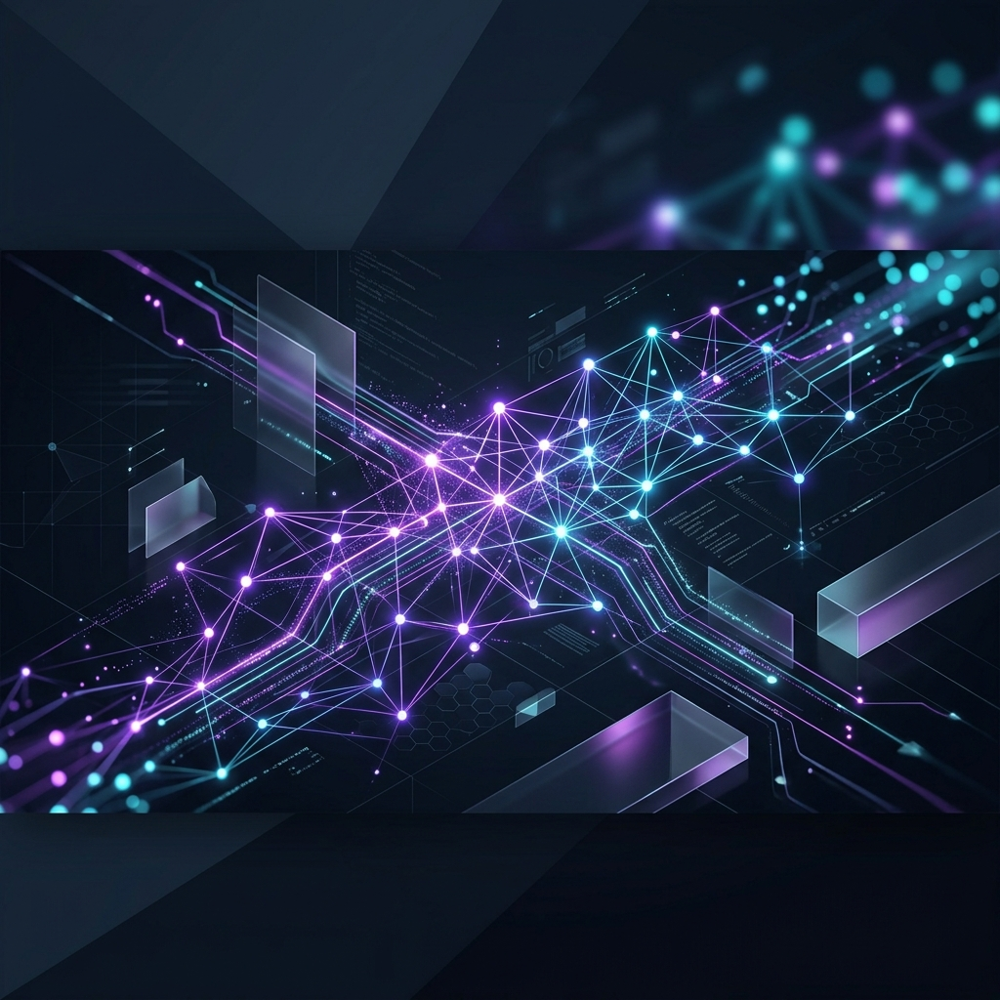

<div align="center">
  
  
  # 🚀 AI for All: Master Modern AI Engineering
  
  **A world-class interactive learning platform designed for Cloud, DevOps, and Platform Engineers to transition into AI Engineering.**

  [](https://vikram512700.github.io/Ai_for_All/)
  [](https://vikram512700.github.io/Ai_for_All/)
  [](#)

</div>

<br/>

## 🌟 Overview

Welcome to **AI for All**! This project is a comprehensive, interactive HTML/CSS/JS portal that takes you from zero AI knowledge to building production-grade Agentic AI and RAG systems. It features a premium, modern "glassmorphism" design with deep-dive technical modules.

👉 **[Click here to view the live interactive portal!](https://vikram512700.github.io/Ai_for_All/)**

---

## 📚 Core Learning Modules

| Module | Description |
| :--- | :--- |
| 🧠 **Fundamentals** | Understand Tokens, Transformers, Embeddings, Temperature, and text generation. |
| ✨ **Claude & Prompts** | Master Claude Code, context windows, SKILL.md files, and open-source agents. |
| 🔍 **RAG & Vector Search** | Connect LLMs to enterprise data using Vector DBs, embeddings, and hybrid search. |
| 🤖 **Agentic AI** | Build autonomous agents that plan, use tools, reflect, and solve multi-step problems. |
| 🌐 **MCP** | Learn the Model Context Protocol (MCP) to standardize secure AI tool access. |

## 🛠️ Production & Operations

| Topic | Description |
| :--- | :--- |
| 🛡️ **AI Security (OWASP)** | Defend against prompt injections, excessive agency, and data leakage. |
| 📊 **AI Evaluation (RAGAS)**| Score LLM outputs with Faithfulness and Context Recall using Golden Datasets. |
| ⚙️ **LLMOps** | Deploy, monitor, and maintain LLM applications in production. |
| 💻 **Open Source & FinOps**| Run Ollama locally, optimize token costs, and implement model routing. |

---

## 🗺️ Career Roadmap

Not sure where to start? Check out our built-in **[Career Roadmap](https://vikram512700.github.io/Ai_for_All/roadmap.html)** to map out your transition from traditional Software/Cloud engineering into AI Engineering!

## 🚀 Running Locally

Because this is built with vanilla web technologies, you don't need any complex build steps.

1. Clone the repository:
   ```bash
   git clone https://github.com/vikram512700/Ai_for_All.git
   ```
2. Open `index.html` in your favorite web browser.
3. Enjoy the learning experience!

---

<div align="center">
  <i>Built with ❤️ for the AI Engineering Community</i>
</div>
